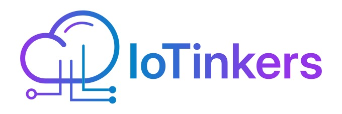

  
  
<i>Building the future of IoT, one project at a time.</i>

  
<i>Construyendo el futuro del IoT, un proyecto a la vez.</i>

[English](#-about-us) | [Español](#-sobre-nosotros)

## 🌟 About Us

IoTinkers is a community dedicated to developing Internet of Things (IoT) projects with a focus on DIY solutions and open hardware. Our goal is to create and share projects that are:

- 🛠️ **Replicable**: Complete and documented designs
- 📖 **Educational**: Focus on learning and understanding
- 🌱 **Sustainable**: Efficient use of resources and energy
- 🤝 **Collaborative**: Open to community contributions

## 🔧 Featured Projects

### [DIY Weather Station](https://github.com/IoTinkers-com/diy-weather-station)
Portable weather station with solar irradiation measurement using ESP32-C6
- Solar irradiation measurement
- Battery and solar panel power
- LCD interface for data visualization
- WiFi connectivity for data transmission

### [ESP32 Telegram Cloud Cam](https://github.com/IoTinkers-com/esp32-telegram-cloud-cam)
ESP32 camera with Telegram bot control
- Camera remote control
- Telegram & Fast API interface
- WiFi connectivity for data transmission

## 💻 Technologies

We work with open source technologies and free hardware:
- **Microcontrollers**: Arduino, ESP32, STM32, RP2040
- **SBCs**: Raspberry Pi, Orange Pi, BeagleBone
- **Languages**: MicroPython, CircuitPython, C/C++, Python
- **Communication**: WiFi, BLE, LoRa, MQTT, I2C, SPI
- **Hardware**: Sensors, actuators, displays, RF modules
- **Design**: KiCad (PCB), FreeCAD (3D), Fritzing

## 🤝 Contributing

We love collaboration! You can contribute by:
- Reporting issues
- Suggesting improvements
- Sharing your modifications
- Documenting your experiences
- Creating tutorials

---

## 🌟 Sobre Nosotros

IoTinkers es una comunidad dedicada al desarrollo de proyectos de Internet de las Cosas (IoT) con un enfoque en soluciones DIY y hardware abierto. Nuestro objetivo es crear y compartir proyectos que sean:

- 🛠️ **Replicables**: Diseños completos y documentados
- 📖 **Educativos**: Enfoque en el aprendizaje y la comprensión
- 🌱 **Sostenibles**: Uso eficiente de recursos y energía
- 🤝 **Colaborativos**: Abiertos a contribuciones de la comunidad

## 🔧 Proyectos Destacados

### [DIY Weather Station](https://github.com/IoTinkers-com/diy-weather-station)
Estación meteorológica portátil con medición de irradiación solar usando ESP32-C6
- Medición de irradiación solar
- Alimentación por batería y panel solar
- Interfaz LCD para visualización de datos
- Conectividad WiFi para transmisión de datos

### [ESP32 Telegram Cloud Cam](https://github.com/IoTinkers-com/esp32-telegram-cloud-cam)
Cámara ESP32 con control mediante bot de Telegram
- Control remoto de cámara
- Interfaz de Telegram y Fast API
- Conectividad WiFi para transmisión de datos

## 💻 Tecnologías

Trabajamos con tecnologías open source y hardware libre:
- **Microcontroladores**: Arduino, ESP32, STM32, RP2040
- **SBCs**: Raspberry Pi, Orange Pi, BeagleBone
- **Lenguajes**: MicroPython, CircuitPython, C/C++, Python
- **Comunicación**: WiFi, BLE, LoRa, MQTT, I2C, SPI
- **Hardware**: Sensores, actuadores, displays, módulos RF
- **Diseño**: KiCad (PCB), FreeCAD (3D), Fritzing

## 🤝 Contribuir

¡Nos encanta la colaboración! Puedes contribuir:
- Reportando problemas
- Sugiriendo mejoras
- Compartiendo tus modificaciones
- Documentando tus experiencias
- Creando tutoriales

## 📜 Licencias

Nuestros proyectos generalmente utilizan:
- **Software**: MIT License
- **Hardware**: CERN Open Hardware License
- **Documentación**: Creative Commons (CC BY 4.0)
- **Contenido Multimedia**: CC BY-SA 4.0

## 📫 Contacto

- GitHub: [@IoTinkers-com](https://github.com/IoTinkers-com)
- Sitio Web: [IoTinkers.com](https://IoTinkers.com)

---

  <i>Construyendo el futuro del IoT, un proyecto a la vez.</i>

